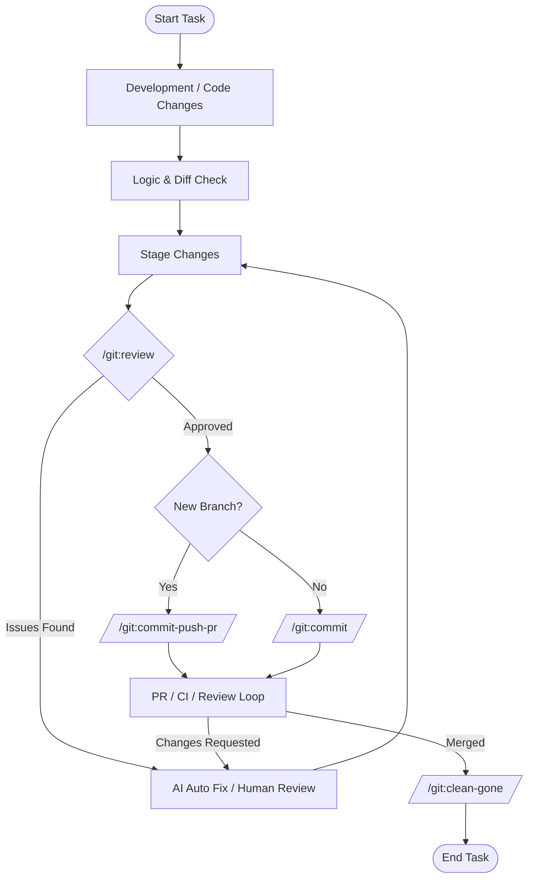

# Gemini CLI Git Extension

[简体中文](./README_zh.md)

This is a Gemini CLI extension that provides convenient Git commands to streamline your development workflow.

## Features

- **AI-powered commit messages**: Leverages Gemini's capabilities to generate conventional commit messages based on your staged changes.
- **Streamlined branching**: Quickly commit your changes to a new branch.
- **Integrated with Gemini CLI**: Seamlessly integrates into the Gemini CLI environment.

## Commands

This extension provides the following commands:

- `/git:review`: Review staged changes.
- `/git:commit`: Analyzes your staged Git changes and generates a descriptive commit message following the Conventional Commits specification.
- `/git:commit-push-pr`: Commit changes, push to remote, and create a Pull Request (GitHub/GitLab).
- `/git:clean-gone`: Clean up local branches that have been deleted on the remote.

## Workflow

Here is a recommended development workflow using these commands:



## Prerequisites

To fully utilize the automation features (specifically `/git:commit-push-pr`), ensure you have the CLI tool corresponding to your platform installed and authenticated:

- **GitHub**: [GitHub CLI (`gh`)](https://cli.github.com/)
- **GitLab**: [GitLab CLI (`glab`)](https://gitlab.com/gitlab-org/cli)

## Installation

Install the Git extension by running the following command from your terminal *(requires Gemini CLI)*:

```bash
gemini extensions install https://github.com/ox01024/gemini-cli-git 
```

## Usage

You can invoke the commands directly from the Gemini CLI prompt:

To review staged changes:
```
/git:review
```

To generate a commit message for your currently staged changes:

```
/git:commit
```

To commit, push, and create a PR:
```
/git:commit-push-pr
```

To clean up gone branches:
```
/git:clean-gone
```

## Legal

- License: Apache License 2.0