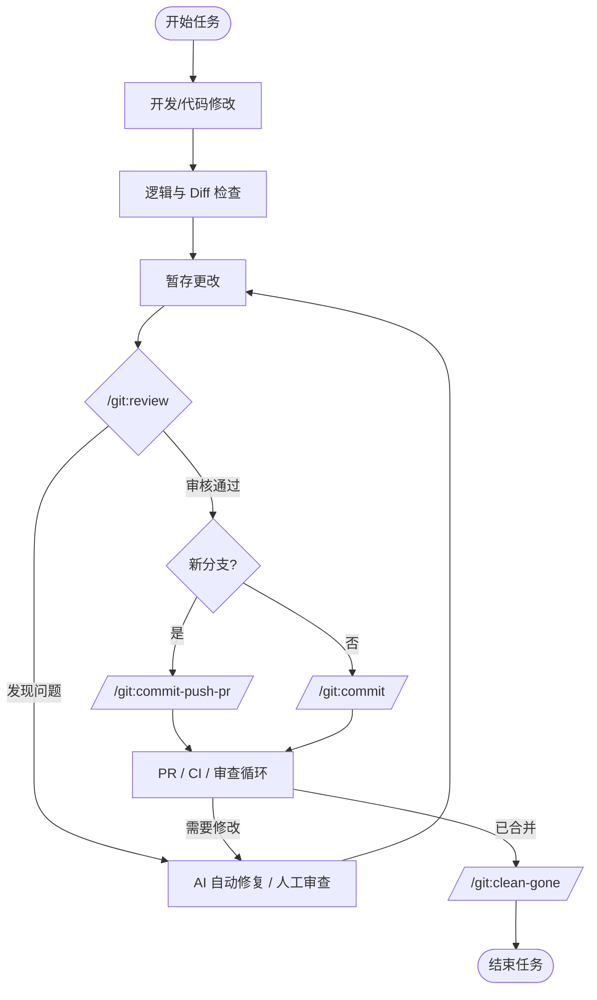

# Gemini CLI Git 扩展

这是一个 Gemini CLI 扩展，提供便捷的 Git 命令来简化您的开发工作流程。

## 功能

- **AI 驱动的 Commit Message**: 利用 Gemini 的能力，根据您暂存的更改生成符合 Conventional Commits 规范的提交信息。
- **简化的分支流程**: 快速将您的更改提交到一个新分支。
- **与 Gemini CLI 集成**: 无缝集成到 Gemini CLI 环境中。

## 命令

此扩展提供以下命令：

- `/git:review`: Review 暂存的更改。
- `/git:commit`: 分析您暂存的 Git 更改，并生成符合 Conventional Commits 规范的描述性提交信息。
- `/git:commit-push-pr`: 提交、推送并创建 PR/MR（支持 GitHub 和 GitLab）。
- `/git:clean-gone`: 清理远程已删除的本地分支。

## 工作流

推荐使用以下工作流来进行开发：



## 前置要求

为了充分利用自动化功能（特别是 `/git:commit-push-pr`），请确保安装并配置了对应平台的命令行工具：

- **GitHub**: [GitHub CLI (`gh`)](https://cli.github.com/)
- **GitLab**: [GitLab CLI (`glab`)](https://gitlab.com/gitlab-org/cli)

## 安装

在您的终端中运行以下命令来安装此 Git 扩展（需要 Gemini CLI）：

```bash
gemini extensions install https://github.com/ox01024/gemini-cli-git 
```

## 使用方法

您可以直接在 Gemini CLI 提示符中调用这些命令：

Review 暂存的更改：
```
/git:review
```

为当前暂存的更改生成提交信息：
```
/git:commit
```

提交、推送并创建 PR：
```
/git:commit-push-pr
```

清理已删除分支：
```
/git:clean-gone
```

## 法律

- 许可证: Apache License 2.0